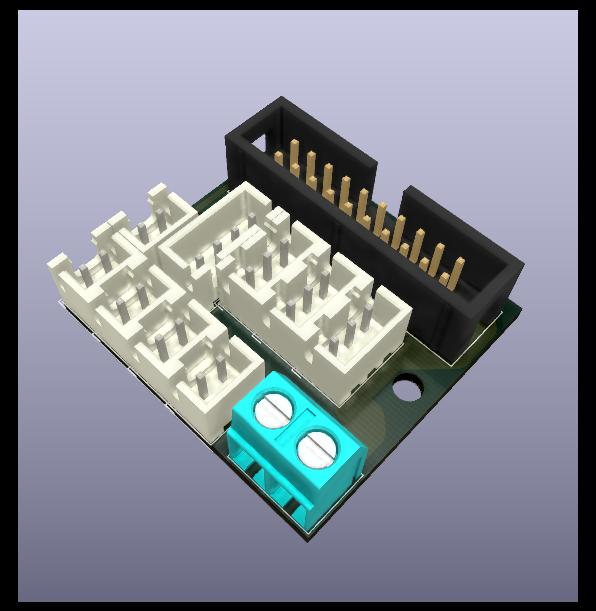
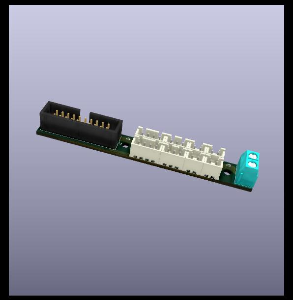
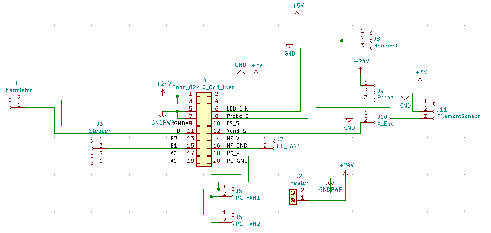
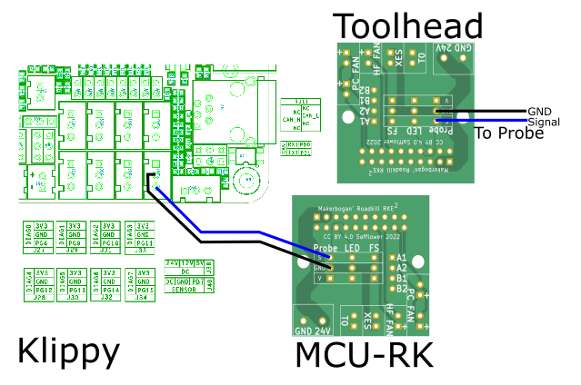
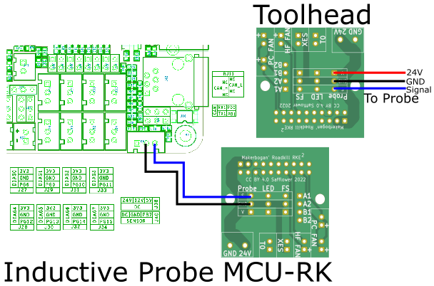
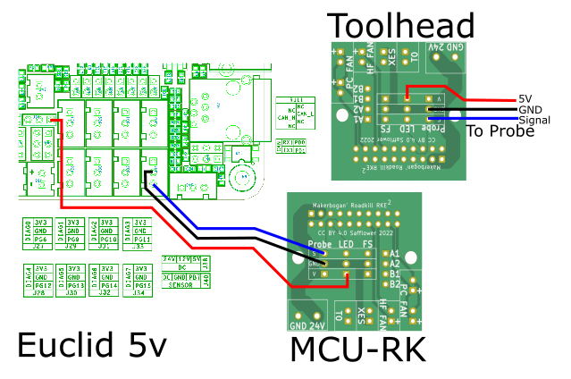
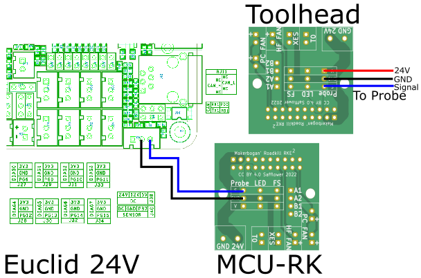

A MakerBogans & Safflower Production

# Roadkill Enhanced Toolhead PCB Family

The RKE family of toolhead boards are based off the roadkill board designed xbst\_ but offers numerous improvements.

- Heater current capacity is greatly improved offering 5A of capacity on the RKE-Long board and 6A on RKE2.
- Support for simultaneous use of neopixels, filament sensor, inductive probe and x endstop switch with dedicated ports for all features.
- All boards within the RKE family are pin compatible allowing for mix and matching of boards.

  
   

## Important Notes

- Heater screw terminal is polarised, as the 24V supply is used as a common rail.
- Nylon or printed washers should be used to protect the mounting holes due to the proximity of the traces to the holes.
- LED port is designed for neopixels and uses a common 5V rail with the filament sensor port.
- Probe port has a 24V power rail derived from the heater.

&#9888;<b>Do not connect a wire between the MCU and the Roadkill probe port for V, this will result in backfeeding 24V into the MCU. V is provided from the Heater</b>

## BOM

Per Board,

- 1 x 20 pin IDC header (2x10 2.54mm pitch)
- 5 x 2 pin JST-XH
- 3 x 3 pin JST-XH (2x for RKE Long)
- 1 x 4 pin JST-XH (2X for RKE Long)
- 1 x 5 mm pitch screw terminal (TB00250002BE)

Molex temp-flex ribbon is the preferred ribbon solution (Molex, 100057-0101).

For IDC connector/sockets 3M D89120-0131HK with D3448-89120 strain relief clip are the preferred solutions.

## Pinout for Ports

IDC numbering is ODD_EVEN with 1 denoted by an arrow on the PCB

Pin 1 of the JST-XH ports is the square pads on the PCB.

For RKE2

| Port             | Pin 1 (IDC PIN)  | Pin 2 (IDC PIN) | Pin 3 (IDC PIN) | Pin 4 (IDC PIN) |
| ---------------- | ---------------- | --------------- | --------------- | --------------- |
| Layer Fan        | Fan Voltage (18) | Fan GND (20)    | -               | -               |
| Heater Fan       | Fan Voltage (14) | Fan GND (16)    | -               | -               |
| X endstop        | GND (2)          | Signal (12)     | -               | -               |
| Filament Sensor  | 5 V (4)          | GND (2)         | Signal (10)     | -               |
| Neopixel         | 5 V (4)          | GND (2)         | Data In (6)     | -               |
| Probe            | 24 (1,2)         | GND (2)         | Signal (8)      | -               |
| Thermistor (T0)  | T0 (11)          | GNDA (9)        | -               | -               |
| Extruder Stepper | A1 (19)          | A2 (17)         | B1 (15)         | B2 (13)         |
| Heater           | 24 V (1,3)       | HE GND (5,7)    | -               | -               |

RKE Long utilises a combined Filament Sensor and X endstop port pinout is below.

| Port                | Pin 1 (IDC PIN) | Pin 2 (IDC PIN) | Pin 3 (IDC PIN) | Pin 4 (IDC PIN) |
| ------------------- | --------------- | --------------- | --------------- | --------------- |
| Combined FS and XES | 5 V (4)         | GND (2)         | Signal (12)     | Signal (10)     |

# Schematic

# Probe Wiring
It is critical to wire Z probe correctly to avoid damage to MCU. Follow the below wiring guides

|  |  |
| --- | --- |
|   |  |
| |   |

# Troubleshooting

| Number | Symptoms | Cause | Solution |
|---| --- | --- | --- |
| 1 | X endstop is permently triggered or not triggering | X end stop is shorted to GND on the MCU->Roadkill board, S is connected to G on the X endstop port  | Swap X endstop pins on the MCU->Roadkill board |
| 2 | Probe disconnecting when heater is turned  on, Flickering Probe during PWM control of the Probe | Reversed Polarity on the 24 V Screw terminal on the MCU->Roadkill board | Swap  Heater Wires on the MCU->Roadkill board |

# License

 This work is licensed under a <a rel="license" href="http://creativecommons.org/licenses/by/4.0/">Creative Commons Attribution 4.0 International License</a>.
